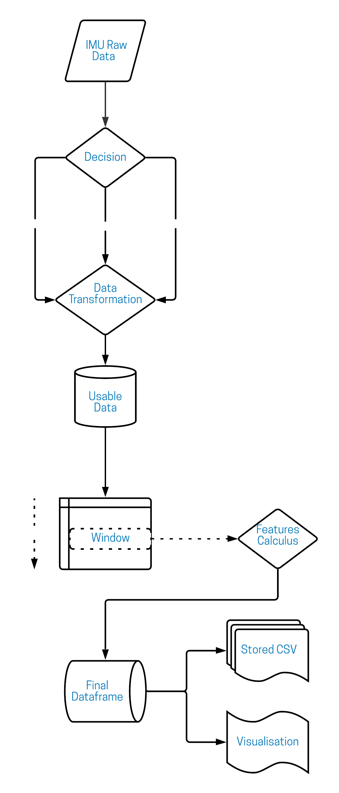

# PythonDFTMotionP3

As a Data Science intern at CRI Motion Lab, I develop an algorithm that extract meaningful features from raw Inertial Measurement Unit (IMU) data in order to build a dataset for training a gesture classification machine learning model.


Table of Content
-----------------
  * Project Description
  * Set up
  * Launching the App
  * The dashboard
  * Made with
  * Authors
  * License


# Algorithm Architecture :triangular_ruler:




 # Set Up :wrench:
Clone this repository using command 

```
git clone https://github.com/paulmontecot/PythonDFTMotionP3.git
```
 
Create a python virtual environnemnt and install the requirement.txt package using pip :

```
pip install -r requirements.txt
```

The requirements.txt contains : 

```
numpy==1.20.3
pandas==1.2.4
plotly==4.14.3
plotly-express==0.4.1

```

Open your IDE, open the project and you are ready to launch the app !


:sparkling_heart: Enjoy ! :sparkling_heart:


# Made with :construction:

Here are the programs / software / resources that we used to develop our project.

* [Python 3.9](https://www.python.org/) - Programming language version 3.9
* [Materialize.css](http://materializecss.com) - Framework CSS (front-end)
* [PyCharm](https://www.jetbrains.com/fr-fr/pycharm/) - IDE
* [Jupyter Notebook](https://jupyter.org/) - Open-source web application to create and share code
* [Deenote](https://deepnote.com/project/CovidDashOpenSource-vWDQOttkRneLrrNERsUCUg/%2Fnotebook.ipynb) - Data Science NoteBook


## Author :crown:

* **Paul** [@paulmontecot](https://github.com/paulmontecot)


## License :white_check_mark:

[](https://opensource.org/licenses/MIT)
